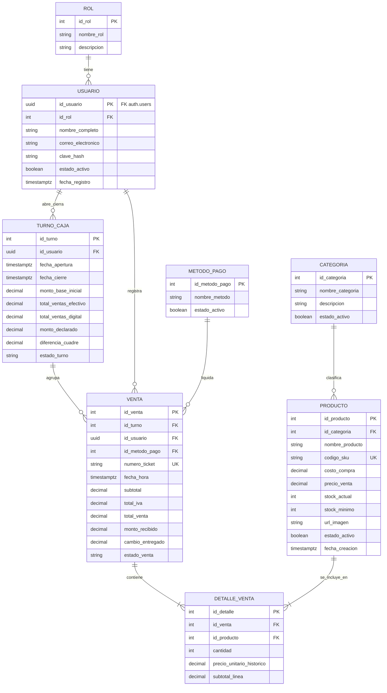
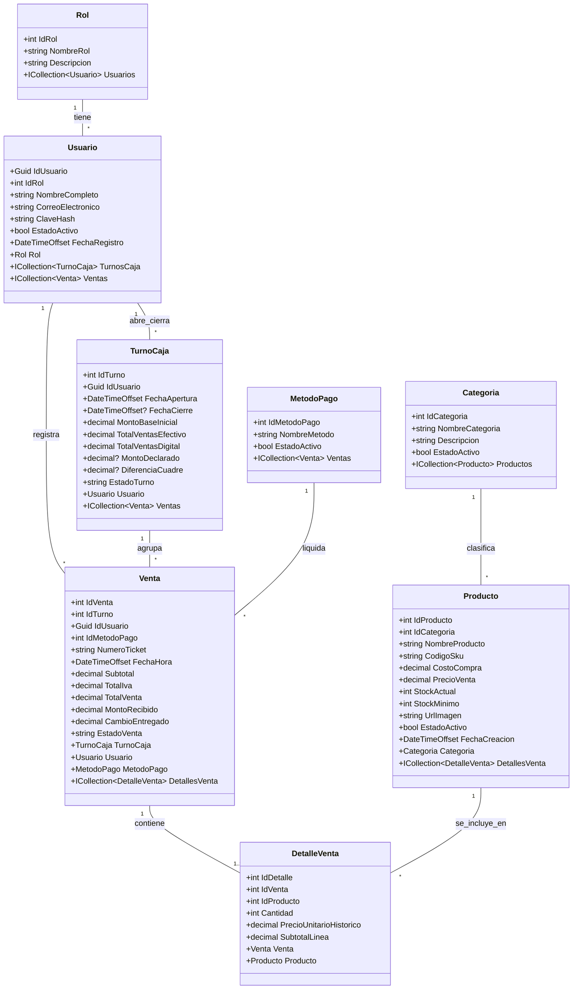

# Modelo y Diagrama de Base de Datos — TiendaGo (Supabase / PostgreSQL)

Este documento contiene la arquitectura de datos relacional para **TiendaGo** (Sistema POS Móvil y Gestión de Inventario Express) optimizada para **Supabase (PostgreSQL)**, cubriendo todos los requerimientos funcionales (**RF01 - RF07**), requerimientos no funcionales (**RNF01 - RNF04**), integración con **Supabase Auth** (`auth.users`), control transaccional ACID para inventario, **Row Level Security (RLS)** y suscripciones en tiempo real (**Supabase Realtime**).

---

## 1. Código DBML (para dbdiagram.io / DiagramBD)

> **Instrucciones de uso en [dbdiagram.io](https://dbdiagram.io/):**
> 1. Ingresa a [https://dbdiagram.io/d](https://dbdiagram.io/).
> 2. Borra el código de ejemplo del panel izquierdo.
> 3. Pega el siguiente bloque de código DBML.
> 4. El diagrama visual ER se generará automáticamente en tiempo real con todas las tablas, columnas, tipos de datos, restricciones y relaciones adaptadas a PostgreSQL/Supabase.

```dbml
// ==========================================
// TIENDAGO - BASE DE DATOS (SUPABASE / POSTGRESQL)
// Sistema POS Móvil y Gestión de Inventario Express
// ==========================================

Table Roles {
  id_rol int [pk, increment]
  nombre_rol varchar(50) [not null, unique, note: 'Administrador, Cajero, Supervisor']
  descripcion varchar(200) [null]
}

Table Usuarios {
  id_usuario uuid [pk, note: 'FK directa a auth.users(id)']
  id_rol int [not null, ref: > Roles.id_rol]
  nombre_completo varchar(150) [not null]
  correo_electronico varchar(150) [not null, unique]
  clave_hash varchar(255) [null, note: 'Gestionada nativamente por Supabase Auth (auth.users)']
  estado_activo boolean [not null, default: true]
  fecha_registro timestamptz [not null, default: `now()`]
}

Table Categorias {
  id_categoria int [pk, increment]
  nombre_categoria varchar(100) [not null, unique, note: 'Bebidas, Snacks, Abarrotes, Lácteos, etc.']
  descripcion varchar(255) [null]
  estado_activo boolean [not null, default: true]
}

Table Productos {
  id_producto int [pk, increment]
  id_categoria int [not null, ref: > Categorias.id_categoria]
  nombre_producto varchar(150) [not null]
  codigo_sku varchar(50) [not null, unique, note: 'Código de barras escaneable por cámara o SKU']
  costo_compra decimal(10,2) [not null, default: 0.00]
  precio_venta decimal(10,2) [not null]
  stock_actual int [not null, default: 0, note: 'Descontado en tiempo real tras cada venta']
  stock_minimo int [not null, default: 5, note: 'Umbral para alertas de stock crítico']
  url_imagen varchar(300) [null]
  estado_activo boolean [not null, default: true]
  fecha_creacion timestamptz [not null, default: `now()`]

  indexes {
    (codigo_sku) [unique]
    (id_categoria, estado_activo) [name: 'idx_productos_categoria_activo']
  }
}

Table MetodosPago {
  id_metodo_pago int [pk, increment]
  nombre_metodo varchar(50) [not null, unique, note: 'Efectivo, Transferencia QR, Tarjeta Débito/Crédito']
  estado_activo boolean [not null, default: true]
}

Table TurnosCaja {
  id_turno int [pk, increment]
  id_usuario uuid [not null, ref: > Usuarios.id_usuario]
  fecha_apertura timestamptz [not null, default: `now()`]
  fecha_cierre timestamptz [null]
  monto_base_inicial decimal(10,2) [not null, default: 0.00]
  total_ventas_efectivo decimal(10,2) [not null, default: 0.00]
  total_ventas_digital decimal(10,2) [not null, default: 0.00]
  monto_declarado decimal(10,2) [null]
  diferencia_cuadre decimal(10,2) [null]
  estado_turno varchar(20) [not null, default: 'Abierto', note: 'Abierto, Cerrado, Arqueado']

  indexes {
    (id_usuario, estado_turno) [name: 'idx_turnos_usuario_estado']
  }
}

Table Ventas {
  id_venta int [pk, increment]
  id_turno int [not null, ref: > TurnosCaja.id_turno]
  id_usuario uuid [not null, ref: > Usuarios.id_usuario]
  id_metodo_pago int [not null, ref: > MetodosPago.id_metodo_pago]
  numero_ticket varchar(30) [not null, unique, note: 'ej. TCK-2026-0001']
  fecha_hora timestamptz [not null, default: `now()`]
  subtotal decimal(10,2) [not null]
  total_iva decimal(10,2) [not null, default: 0.00]
  total_venta decimal(10,2) [not null]
  monto_recibido decimal(10,2) [not null]
  cambio_entregado decimal(10,2) [not null, default: 0.00]
  estado_venta varchar(20) [not null, default: 'Completada', note: 'Completada, Anulada, Pendiente']

  indexes {
    (numero_ticket) [unique]
    (id_turno, fecha_hora) [name: 'idx_ventas_turno_fecha']
    (id_usuario, fecha_hora) [name: 'idx_ventas_usuario_fecha']
  }
}

Table DetallesVenta {
  id_detalle int [pk, increment]
  id_venta int [not null, ref: > Ventas.id_venta]
  id_producto int [not null, ref: > Productos.id_producto]
  cantidad int [not null, note: 'Unidades vendidas (> 0)']
  precio_unitario_historico decimal(10,2) [not null, note: 'Precio congelado al momento de la venta']
  subtotal_linea decimal(10,2) [not null]

  indexes {
    (id_venta, id_producto) [name: 'idx_detalle_venta_producto']
  }
}
```

---

## 2. Diagrama Entidad-Relación (Mermaid ER)

Visualizable directamente en Markdown, GitHub, Mermaid Live Editor o VS Code:



---

## 3. Diagrama de Clases del Modelo de Dominio (C# / Supabase Client)

Representa las entidades del dominio con sus tipos mapeados a .NET / C# y PostgreSQL / Supabase:



---

## 4. Script DDL para Supabase (PostgreSQL + RLS + Triggers + Realtime)

```sql
-- =============================================
-- TIENDAGO - SCRIPT DE BASE DE DATOS (SUPABASE / POSTGRESQL)
-- Sistema POS Móvil y Gestión de Inventario Express
-- =============================================

-- Extensiones requeridas
CREATE EXTENSION IF NOT EXISTS "uuid-ossp";

-- 1. Tabla de Roles de Usuario
CREATE TABLE public.roles (
    id_rol BIGINT GENERATED ALWAYS AS IDENTITY PRIMARY KEY,
    nombre_rol VARCHAR(50) NOT NULL UNIQUE,
    descripcion VARCHAR(200) NULL
);

-- Inserción de roles del sistema
INSERT INTO public.roles (nombre_rol, descripcion) VALUES
('Administrador', 'Control total de inventario, catálogo, reportes y configuración de usuarios'),
('Cajero', 'Operación de terminal POS de ventas, apertura y cierre de turnos de caja'),
('Supervisor', 'Auditoría de historial de ventas, métricas de rendimiento y cuadre de cajas');

-- 2. Tabla de Usuarios (Vinculada a auth.users de Supabase)
CREATE TABLE public.usuarios (
    id_usuario UUID PRIMARY KEY REFERENCES auth.users(id) ON DELETE CASCADE,
    id_rol BIGINT NOT NULL REFERENCES public.roles(id_rol),
    nombre_completo VARCHAR(150) NOT NULL,
    correo_electronico VARCHAR(150) NOT NULL UNIQUE,
    clave_hash VARCHAR(255) NULL, -- Administrada por Supabase Auth
    estado_activo BOOLEAN NOT NULL DEFAULT TRUE,
    fecha_registro TIMESTAMPTZ NOT NULL DEFAULT NOW()
);

-- 3. Tabla de Categorías de Producto
CREATE TABLE public.categorias (
    id_categoria BIGINT GENERATED ALWAYS AS IDENTITY PRIMARY KEY,
    nombre_categoria VARCHAR(100) NOT NULL UNIQUE,
    descripcion VARCHAR(255) NULL,
    estado_activo BOOLEAN NOT NULL DEFAULT TRUE
);

-- Inserción de categorías base
INSERT INTO public.categorias (nombre_categoria, descripcion) VALUES
('Bebidas', 'Refrescos, jugos, aguas y bebidas energéticas'),
('Snacks', 'Papas fritas, galletas, golosinas y bocadillos'),
('Abarrotes', 'Granos básicos, aceites, pastas y enlatados'),
('Lácteos', 'Leche, quesos, yogures y derivados'),
('Limpieza y Hogar', 'Detergentes, desinfectantes y artículos del hogar');

-- 4. Tabla de Productos (Inventario en Tiempo Real)
CREATE TABLE public.productos (
    id_producto BIGINT GENERATED ALWAYS AS IDENTITY PRIMARY KEY,
    id_categoria BIGINT NOT NULL REFERENCES public.categorias(id_categoria),
    nombre_producto VARCHAR(150) NOT NULL,
    codigo_sku VARCHAR(50) NOT NULL UNIQUE,
    costo_compra DECIMAL(10,2) NOT NULL DEFAULT 0.00 CHECK (costo_compra >= 0),
    precio_venta DECIMAL(10,2) NOT NULL CHECK (precio_venta >= 0),
    stock_actual INT NOT NULL DEFAULT 0 CHECK (stock_actual >= 0),
    stock_minimo INT NOT NULL DEFAULT 5 CHECK (stock_minimo >= 0),
    url_imagen VARCHAR(300) NULL,
    estado_activo BOOLEAN NOT NULL DEFAULT TRUE,
    fecha_creacion TIMESTAMPTZ NOT NULL DEFAULT NOW()
);

-- 5. Tabla de Métodos de Pago
CREATE TABLE public.metodos_pago (
    id_metodo_pago BIGINT GENERATED ALWAYS AS IDENTITY PRIMARY KEY,
    nombre_metodo VARCHAR(50) NOT NULL UNIQUE,
    estado_activo BOOLEAN NOT NULL DEFAULT TRUE
);

-- Inserción de métodos de pago soportados
INSERT INTO public.metodos_pago (nombre_metodo) VALUES
('Efectivo'),
('Transferencia QR'),
('Tarjeta Débito/Crédito');

-- 6. Tabla de Turnos de Caja (Apertura, Operación y Cuadre)
CREATE TABLE public.turnos_caja (
    id_turno BIGINT GENERATED ALWAYS AS IDENTITY PRIMARY KEY,
    id_usuario UUID NOT NULL REFERENCES public.usuarios(id_usuario),
    fecha_apertura TIMESTAMPTZ NOT NULL DEFAULT NOW(),
    fecha_cierre TIMESTAMPTZ NULL,
    monto_base_inicial DECIMAL(10,2) NOT NULL DEFAULT 0.00 CHECK (monto_base_inicial >= 0),
    total_ventas_efectivo DECIMAL(10,2) NOT NULL DEFAULT 0.00 CHECK (total_ventas_efectivo >= 0),
    total_ventas_digital DECIMAL(10,2) NOT NULL DEFAULT 0.00 CHECK (total_ventas_digital >= 0),
    monto_declarado DECIMAL(10,2) NULL,
    diferencia_cuadre DECIMAL(10,2) NULL,
    estado_turno VARCHAR(20) NOT NULL DEFAULT 'Abierto' CHECK (estado_turno IN ('Abierto', 'Cerrado', 'Arqueado'))
);

-- 7. Tabla de Ventas (Encabezado de Transacción POS)
CREATE TABLE public.ventas (
    id_venta BIGINT GENERATED ALWAYS AS IDENTITY PRIMARY KEY,
    id_turno BIGINT NOT NULL REFERENCES public.turnos_caja(id_turno),
    id_usuario UUID NOT NULL REFERENCES public.usuarios(id_usuario),
    id_metodo_pago BIGINT NOT NULL REFERENCES public.metodos_pago(id_metodo_pago),
    numero_ticket VARCHAR(30) NOT NULL UNIQUE,
    fecha_hora TIMESTAMPTZ NOT NULL DEFAULT NOW(),
    subtotal DECIMAL(10,2) NOT NULL CHECK (subtotal >= 0),
    total_iva DECIMAL(10,2) NOT NULL DEFAULT 0.00 CHECK (total_iva >= 0),
    total_venta DECIMAL(10,2) NOT NULL CHECK (total_venta >= 0),
    monto_recibido DECIMAL(10,2) NOT NULL CHECK (monto_recibido >= 0),
    cambio_entregado DECIMAL(10,2) NOT NULL DEFAULT 0.00 CHECK (cambio_entregado >= 0),
    estado_venta VARCHAR(20) NOT NULL DEFAULT 'Completada' CHECK (estado_venta IN ('Completada', 'Anulada', 'Pendiente'))
);

-- 8. Tabla de Detalles de Venta (Líneas de Artículos Vendidos)
CREATE TABLE public.detalles_venta (
    id_detalle BIGINT GENERATED ALWAYS AS IDENTITY PRIMARY KEY,
    id_venta BIGINT NOT NULL REFERENCES public.ventas(id_venta) ON DELETE CASCADE,
    id_producto BIGINT NOT NULL REFERENCES public.productos(id_producto),
    cantidad INT NOT NULL CHECK (cantidad > 0),
    precio_unitario_historico DECIMAL(10,2) NOT NULL CHECK (precio_unitario_historico >= 0),
    subtotal_linea DECIMAL(10,2) NOT NULL CHECK (subtotal_linea >= 0)
);

-- =============================================
-- ÍNDICES DE RENDIMIENTO Y OPTIMIZACIÓN
-- =============================================
CREATE INDEX ix_productos_categoria_activo ON public.productos(id_categoria, estado_activo);
CREATE INDEX ix_productos_sku ON public.productos(codigo_sku);
CREATE INDEX ix_turnos_usuario_estado ON public.turnos_caja(id_usuario, estado_turno);
CREATE INDEX ix_ventas_turno_fecha ON public.ventas(id_turno, fecha_hora DESC);
CREATE INDEX ix_ventas_usuario_fecha ON public.ventas(id_usuario, fecha_hora DESC);
CREATE INDEX ix_detalles_venta_venta ON public.detalles_venta(id_venta);
CREATE INDEX ix_detalles_venta_producto ON public.detalles_venta(id_producto);

-- =============================================
-- TRIGGER 1: SINCRONIZAR AUTH.USERS -> PUBLIC.USUARIOS
-- =============================================
CREATE OR REPLACE FUNCTION public.handle_new_pos_user()
RETURNS TRIGGER AS $$
DECLARE
    v_rol_default BIGINT;
BEGIN
    -- Asigna rol de Cajero por defecto si no se especifica
    SELECT id_rol INTO v_rol_default FROM public.roles WHERE nombre_rol = 'Cajero' LIMIT 1;

    INSERT INTO public.usuarios (
        id_usuario,
        id_rol,
        nombre_completo,
        correo_electronico,
        estado_activo
    ) VALUES (
        NEW.id,
        COALESCE(v_rol_default, 2),
        COALESCE(NEW.raw_user_meta_data->>'nombre_completo', 'Operador POS'),
        NEW.email,
        TRUE
    );

    RETURN NEW;
END;
$$ LANGUAGE plpgsql SECURITY DEFINER;

CREATE OR REPLACE TRIGGER on_auth_user_created_tiendago
    AFTER INSERT ON auth.users
    FOR EACH ROW EXECUTE FUNCTION public.handle_new_pos_user();

-- =============================================
-- TRIGGER 2: CONTROL TRANSACCIONAL ACID DE INVENTARIO (RF06)
-- Descuenta automáticamente el stock disponible y valida existencia
-- =============================================
CREATE OR REPLACE FUNCTION public.fn_descontar_stock_venta()
RETURNS TRIGGER AS $$
DECLARE
    v_stock_actual INT;
    v_nombre_prod VARCHAR(150);
BEGIN
    -- Bloqueo pesimista de fila (FOR UPDATE) para prevenir condiciones de carrera concurrentes
    SELECT stock_actual, nombre_producto 
    INTO v_stock_actual, v_nombre_prod
    FROM public.productos 
    WHERE id_producto = NEW.id_producto 
    FOR UPDATE;

    IF NOT FOUND THEN
        RAISE EXCEPTION 'El producto con ID % no existe en inventario.', NEW.id_producto;
    END IF;

    IF v_stock_actual < NEW.cantidad THEN
        RAISE EXCEPTION 'Stock insuficiente para el producto "%". Existencia actual: %, Solicitado: %', 
            v_nombre_prod, v_stock_actual, NEW.cantidad;
    END IF;

    -- Descontar existencia de forma atómica
    UPDATE public.productos
    SET stock_actual = stock_actual - NEW.cantidad
    WHERE id_producto = NEW.id_producto;

    RETURN NEW;
END;
$$ LANGUAGE plpgsql SECURITY DEFINER;

CREATE OR REPLACE TRIGGER trg_descontar_stock_venta
    BEFORE INSERT ON public.detalles_venta
    FOR EACH ROW EXECUTE FUNCTION public.fn_descontar_stock_venta();

-- =============================================
-- TRIGGER 3: RESTAURAR STOCK EN CASO DE ANULACIÓN DE VENTA
-- =============================================
CREATE OR REPLACE FUNCTION public.fn_restaurar_stock_anulacion()
RETURNS TRIGGER AS $$
BEGIN
    IF NEW.estado_venta = 'Anulada' AND OLD.estado_venta <> 'Anulada' THEN
        UPDATE public.productos p
        SET stock_actual = p.stock_actual + d.cantidad
        FROM public.detalles_venta d
        WHERE d.id_venta = NEW.id_venta 
          AND d.id_producto = p.id_producto;
    END IF;
    RETURN NEW;
END;
$$ LANGUAGE plpgsql SECURITY DEFINER;

CREATE OR REPLACE TRIGGER trg_restaurar_stock_anulacion
    AFTER UPDATE OF estado_venta ON public.ventas
    FOR EACH ROW EXECUTE FUNCTION public.fn_restaurar_stock_anulacion();

-- =============================================
-- TRIGGER 4: ACUMULAR VENTAS AL TURNO DE CAJA ACTIVO
-- =============================================
CREATE OR REPLACE FUNCTION public.fn_acumular_venta_turno()
RETURNS TRIGGER AS $$
DECLARE
    v_nombre_metodo VARCHAR(50);
BEGIN
    IF NEW.estado_venta = 'Completada' THEN
        SELECT nombre_metodo INTO v_nombre_metodo 
        FROM public.metodos_pago 
        WHERE id_metodo_pago = NEW.id_metodo_pago;

        IF v_nombre_metodo = 'Efectivo' THEN
            UPDATE public.turnos_caja
            SET total_ventas_efectivo = total_ventas_efectivo + NEW.total_venta
            WHERE id_turno = NEW.id_turno;
        ELSE
            UPDATE public.turnos_caja
            SET total_ventas_digital = total_ventas_digital + NEW.total_venta
            WHERE id_turno = NEW.id_turno;
        END IF;
    END IF;
    RETURN NEW;
END;
$$ LANGUAGE plpgsql SECURITY DEFINER;

CREATE OR REPLACE TRIGGER trg_acumular_venta_turno
    AFTER INSERT ON public.ventas
    FOR EACH ROW EXECUTE FUNCTION public.fn_acumular_venta_turno();

-- =============================================
-- ROW LEVEL SECURITY (RLS) - POLÍTICAS DE SEGURIDAD SUPABASE
-- =============================================
ALTER TABLE public.roles ENABLE ROW LEVEL SECURITY;
ALTER TABLE public.usuarios ENABLE ROW LEVEL SECURITY;
ALTER TABLE public.categorias ENABLE ROW LEVEL SECURITY;
ALTER TABLE public.productos ENABLE ROW LEVEL SECURITY;
ALTER TABLE public.metodos_pago ENABLE ROW LEVEL SECURITY;
ALTER TABLE public.turnos_caja ENABLE ROW LEVEL SECURITY;
ALTER TABLE public.ventas ENABLE ROW LEVEL SECURITY;
ALTER TABLE public.detalles_venta ENABLE ROW LEVEL SECURITY;

-- 1. Roles y Métodos de Pago: Lectura pública/autenticada
CREATE POLICY "Lectura de roles para usuarios autenticados" ON public.roles
    FOR SELECT TO authenticated USING (true);

CREATE POLICY "Lectura de metodos de pago autenticados" ON public.metodos_pago
    FOR SELECT TO authenticated USING (true);

-- 2. Usuarios: Cada usuario puede consultar su propio perfil; Administradores ven todos
CREATE POLICY "Usuarios ven su propio perfil" ON public.usuarios
    FOR SELECT TO authenticated
    USING (
        id_usuario = auth.uid() OR
        EXISTS (
            SELECT 1 FROM public.usuarios u
            JOIN public.roles r ON u.id_rol = r.id_rol
            WHERE u.id_usuario = auth.uid() AND r.nombre_rol = 'Administrador'
        )
    );

-- 3. Categorías y Productos (Catálogo POS):
CREATE POLICY "Productos y categorias visibles para consulta" ON public.categorias
    FOR SELECT TO authenticated USING (estado_activo = true);

CREATE POLICY "Productos activos visibles para terminal POS" ON public.productos
    FOR SELECT TO authenticated USING (estado_activo = true);

CREATE POLICY "Administradores pueden gestionar productos" ON public.productos
    FOR ALL TO authenticated
    USING (
        EXISTS (
            SELECT 1 FROM public.usuarios u
            JOIN public.roles r ON u.id_rol = r.id_rol
            WHERE u.id_usuario = auth.uid() AND r.nombre_rol = 'Administrador'
        )
    );

-- 4. Turnos de Caja: Cajeros operan su turno; Administradores auditan todos
CREATE POLICY "Cajeros gestionan su propio turno" ON public.turnos_caja
    FOR ALL TO authenticated
    USING (
        id_usuario = auth.uid() OR
        EXISTS (
            SELECT 1 FROM public.usuarios u
            JOIN public.roles r ON u.id_rol = r.id_rol
            WHERE u.id_usuario = auth.uid() AND r.nombre_rol IN ('Administrador', 'Supervisor')
        )
    );

-- 5. Ventas y Detalles:
CREATE POLICY "Cajeros insertan y consultan sus ventas" ON public.ventas
    FOR SELECT TO authenticated
    USING (
        id_usuario = auth.uid() OR
        EXISTS (
            SELECT 1 FROM public.usuarios u
            JOIN public.roles r ON u.id_rol = r.id_rol
            WHERE u.id_usuario = auth.uid() AND r.nombre_rol IN ('Administrador', 'Supervisor')
        )
    );

CREATE POLICY "Cajeros pueden registrar ventas" ON public.ventas
    FOR INSERT TO authenticated
    WITH CHECK (id_usuario = auth.uid());

CREATE POLICY "Detalles de venta visibles asociados a ventas autorizadas" ON public.detalles_venta
    FOR SELECT TO authenticated
    USING (
        EXISTS (
            SELECT 1 FROM public.ventas v
            WHERE v.id_venta = detalles_venta.id_venta
              AND (
                  v.id_usuario = auth.uid() OR
                  EXISTS (
                      SELECT 1 FROM public.usuarios u
                      JOIN public.roles r ON u.id_rol = r.id_rol
                      WHERE u.id_usuario = auth.uid() AND r.nombre_rol IN ('Administrador', 'Supervisor')
                  )
              )
        )
    );

CREATE POLICY "Cajeros pueden registrar detalles de venta" ON public.detalles_venta
    FOR INSERT TO authenticated
    WITH CHECK (
        EXISTS (
            SELECT 1 FROM public.ventas v
            WHERE v.id_venta = detalles_venta.id_venta
              AND v.id_usuario = auth.uid()
        )
    );

-- =============================================
-- REPLICACIÓN EN TIEMPO REAL (SUPABASE REALTIME)
-- Permite actualización instantánea de stock en catálogo y ventas en Dashboard
-- =============================================
ALTER PUBLICATION supabase_realtime ADD TABLE public.productos;
ALTER PUBLICATION supabase_realtime ADD TABLE public.ventas;
ALTER PUBLICATION supabase_realtime ADD TABLE public.turnos_caja;
```
